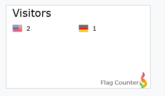
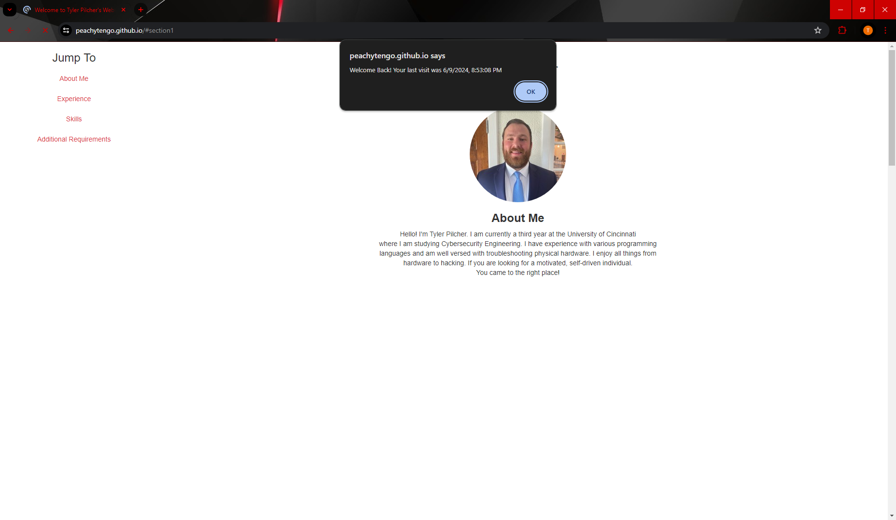

# WAPH-Web Application Programming and Hacking

## Instructor: Dr. Phu Phung

## Student

**Name**: Tyler Pilcher

**Email**: pilchetd@mail.uc.edu

**Short-bio**: Tyler Pilcher has keen interests in ethical hacking and cybersecurity tools. 

 Figure 1: Headshot 

## Repository Information

Respository for this Project: [Personal Website](https://github.com/PeachyTengo/PeachyTengo.github.io)

# Individual Project 1 - Front-end Web Development
## Overview
In this project, I have used the lessons and the capabilities I have learned from the first 3 labs of this semester. The topics included in this project are HTML, CSS, JavaScript, Ajax, jQuery, and API's. From lab 2 I incorporated the show/hide email, the analog and digital clock, and the random joke API. This time the joke was of the category ANY. I have also added in an API from Weatherbit. Lastly, I added cookies to my website that will welcome first time visiters and welcome back someone who has already visited my site.

##  General Requirements
I created and deployed my personal website on Github cloud. In the websie I have included details such as my resume information, name, headshot, contact information and my background. I have also created a link to the waph.html page.

## Non-technical Requirements
For these requirements, I used Bootstrap to include different aspects into my website including but not limited to a navigation bar. I was also able to change the color of the background and the text color. I have also included a page tracker that will display the flag of the country the person has visited from.

 Figure 2: Flag (Page Tracker) 

## Technical Requirements
In this lab I have used JavaScript for multiple different things. I have used JavaScript to implement different exercises from Lab 2. Those include the digital and analog clock and the show/hide email function. I have also implemented two different API's. One to tell a random joke every time the page is refreshed and one to tell the current temperature of Cincinnati, Ohio in fahrenheit. I have also implented cookies, when a person will visit my webiste for the first time they will be welcomed to my website. If they were to visit again, the cookie will welcome them back and will tell them the last time they visited.  

 Figure 3: Cookie Welcoming 
  

 Figure 4: Cookie Welcoming Back 

